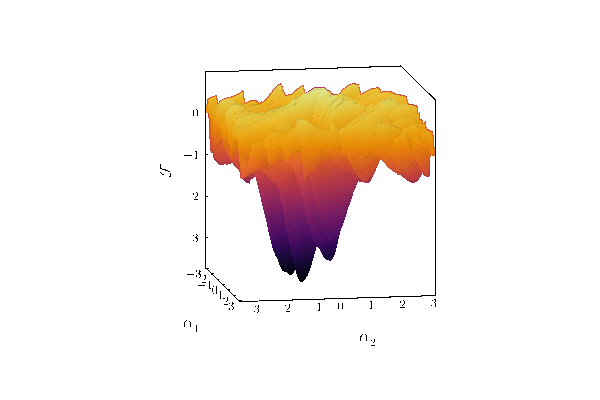
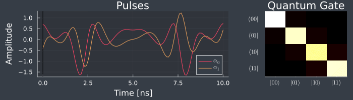

# Pulses.jl

Quantum optimal control made easy. 

## What is Quantum Optimal Control?

We go through life interacting with mechanisms that are _controlled_. For example, cruise control in a car will maintain a specific speed by appropriately applying fuel into the engine (or breaking). Of course, for the car to understand when it should apply fuel, it must have some feedback (_closed-loop control_)-- such as the speedometer. There are systems that do not need feedback (_open-loop control_), such as an electric clothes dryer that will continue operating for some time, regardless of clothes dryness.

Quantum systems, such as quantum computers, have parameters that we can control -- similar to the injection of fuel to a car engine, or the amount of heat to generate for an electric clothes dryer. The goal of quantum optimal control is to produce a desired operation (e.g. a quantum gate, or a quantum state) by computing _pulses_.

## Why Pulses.jl?

There are already many quantum optimal control software packages out in the universe. `Pulses.jl` attempts to be _tiny_ (under 100 lines of code!), while also being quite powerful. We achieve this by utilizing [Julia](https://julialang.org/) and the Julia ecosystem, such as:

- [Zygote.jl](https://github.com/FluxML/Zygote.jl) for automatic differentiation
- [Optim.jl](https://github.com/JuliaNLSolvers/Optim.jl) for multivariate optimization

## Usage

```julia-repl
] activate .
target = [...;...]
system = System(H_d, [H_c, ...])
initial_pulse = [...]
sol = Pulses.find_pulse(target, system, Δt, inital_pulse)
```

You may find more examples in [examples](examples).

## Examples

Here are some examples and visualizations that were generated with `Pulses.jl`. The system Hamiltonians are taken to be [superconducting Transmons](https://en.wikipedia.org/wiki/Transmon).

Namely, the problem is the find pulses $\alpha(t)$ given a model of quantum device, whose Hamiltonian has the general form:

$$H(t) = H_d + \sum_i \alpha_i(t) H_{ci}$$
where $H_d$ is the _drift_ Hamiltonian, and $H_c$ are Hamiltonians that interact with the system with come coupling $\alpha(t)$. The quantum gates are then solutions to the Schrödinger equation:

$$U(t_f, t_i) = \mathcal{T} \exp\left(-i \int_{t_i}^{t_f} H(t) dt\right).$$

The goal is to find $\alpha(t)$ such that $U$ is equal to our desired quantum gate.

### Hadamard Gate (H)

We want the Hadamard gate, which in matrix form is:

```math
H = \frac{1}{\sqrt{2}} \begin{bmatrix} 1 & 1 \\ 1 & -1 \end{bmatrix}
```

`Pulses.jl` finds the minimum of this loss landscape:


We then plot the found pulses, and also evolve a qubit in time using the pulses. Namely, starting in the state $\ket{0}$, we look at $\ket{\psi(t)} = U(t)\ket{0}$, where at final $t=T$, $\ket{\psi(T)} = H\ket{0} = \frac{1}{\sqrt{2}}\left(\ket{0} + \ket{1}\right)$.


Plot of $\ket{\psi(t)}$ on the [Bloch sphere](https://en.wikipedia.org/wiki/Bloch_sphere):


### Controlled-NOT (CNOT)

We want the CNOT gate, which in matrix form is:

```math
CNOT = \begin{bmatrix} 1 & 0 & 0 & 0 \\ 0 & 1 & 0 & 0 \\ 0 & 0 & 0 & 1 \\ 0 & 0 & 1 & 0 \end{bmatrix}
```

`Pulses.jl` finds the minimum of this loss landscape:



We then plot the evolution of the gate $U(t)$ given the found pulses. At final moment in time $t=T$, the gate is indeed $U(T) = CNOT$.



## How to cite

[](https://doi.org/10.5281/zenodo.7443246)

```
@software{Volya_Pulses_jl_A_tiny_2022,
    author = {Volya, Daniel},
    title = {{Pulses.jl: A tiny quantum optimal control library.}},
    month = {12},
    year = {2022},
    publisher = {Zenodo},
    url = {https://github.com/RustyBamboo/Pulses.jl},
}
```


## License

Distributed under the MIT License. See `LICENSE` for more information.
