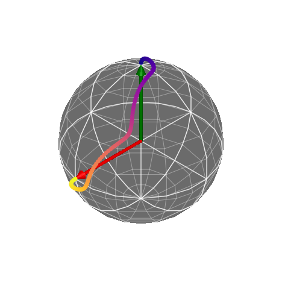
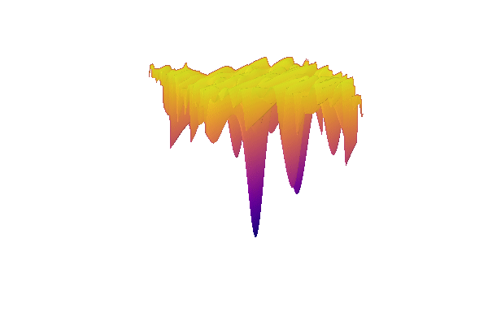

# Pulses.jl

Quantum optimal control made easy. 

## What is Quantum Optimal Control?

We go through life interacting with mechanisms that are _controlled_. For example, cruise control in a car will maintain a specific speed by appropriately applying fuel into the engine (or breaking). Of course, for the car to understand when it should apply fuel, it must have some feedback (_closed-loop control_)-- such as the speedometer. There are systems that do not need feedback (_open-loop control_), such as an electric clothes dryer that will continue operating for some time, regardless of clothes dryness.

Quantum systems, such as quantum computers, have parameters that we can control -- similar to the injection of fuel to a car engine, or the amount of heat to generate for an electric clothes dryer. The goal of quantum optimal control is to produce a desired operation (e.g. a quantum gate, or a quantum state) by computing _pulses_.

## Why Pulses.jl?

There are already many quantum optimal control software packages out in the universe. `Pulses.jl` attempts to be _tiny_ (under 100 lines of code!), while also being quite powerful. We achieve this by utilizing [Julia](https://julialang.org/) and the Julia ecosystem, such as:

- [Zygote.jl](https://github.com/FluxML/Zygote.jl) for automatic differentiation
- [Optim.jl](https://github.com/JuliaNLSolvers/Optim.jl) for multivariate optimization

## Usage

```julia-repl
] activate .
target = [...;...]
system = System(H_d, [H_c, ...])
initial_pulse = [...]
sol = Pulses.find_pulse(target, system, Δt, inital_pulse)
```

You may find more examples in [examples](examples).

## Examples

Preparing the state $\ket{+} = H \ket{0}$




### Loss Landscape



## License

Distributed under the MIT License. See `LICENSE` for more information.
